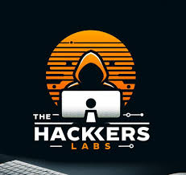
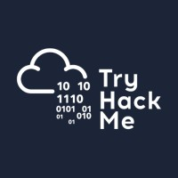

# writeupsCTF

Este es mi repositorio personal donde documento mi proceso de aprendizaje en ciberseguridad ofensiva, centrado principalmente en la resolución de Capture The Flag (CTF) de distintas plataformas. Mi objetivo principal es aprender, mejorar y compartir conocimientos con la comunidad.

Aquí encontrarás:

🔍 Enumeración y análisis de servicios

⚙️ Explotación paso a paso

🧠 Metodologías y razonamientos

📝 Writeups detallados y claros

Cada resolución va orientada a entender el por qué y el cómo, no solo el resultado.

Las principales plataformas y entornos vulnerables usados:&#x20;

<figure><figcaption>
<a href="https://www.hackthebox.com/"><strong>Hack The Box</strong></a>
</figcaption></figure> <figure><figcaption>
<a href="https://thehackerslabs.com/"><strong>Hackerlabs</strong></a>
</figcaption></figure> <figure><figcaption>
<a href="https://tryhackme.com/"><strong>THM</strong></a>
</figcaption></figure> <figure><figcaption>
<a href="https://dockerlabs.es/"><strong>Dockerlabs</strong></a>
</figcaption></figure>

🎯 Objetivo del proyecto

✔ Mejorar mis habilidades en pentesting&#x20;

✔ Crear documentación útil y reutilizable

&#x20;✔ Compartir conocimiento con todo el que quiera aprender

&#x20;✔ Construir un portfolio técnico sólido orientado a contratación

#### ⚔️️ Este espacio no es solo un repositorio: es mi laboratorio personal ⚔️
